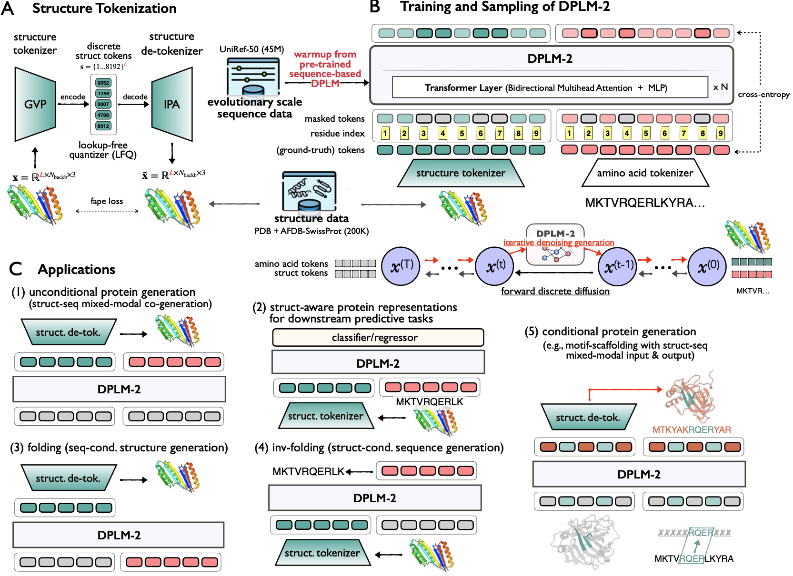
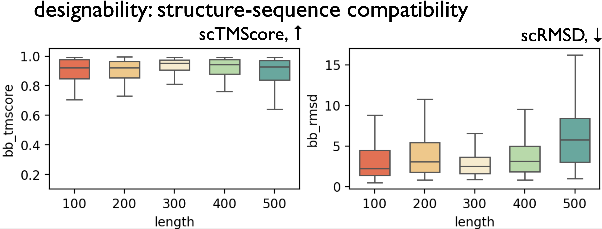

<!-- <div align="center"> -->
<!-- omit in toc -->
# The Family of Diffusion Protein Language Models (DPLM) 🧬
<a href="https://pytorch.org/get-started/locally/"></a>
<a href="https://pytorchlightning.ai/"></a>
<a href="https://hydra.cc/"></a>
<a href="https://github.com/ashleve/lightning-hydra-template"></a><br>

## Overview 🌟

This repository contains the official implementation of training and inference as well as the pre-trained weights for the Family of Diffusion Protein Language Models (DPLM), including:
- `DPLM` from ICML'24 paper ["Diffusion Language Models Are Versatile Protein Learners"](https://arxiv.org/abs/2402.18567), which introduces **d**iffusion **p**rotein **l**anguage **m**odel (DPLM), a versatile protein language model that demonstrates strong generative and predictive capabilities for protein sequences.
- `DPLM-2` from ICLR'25 paper ["DPLM-2: A Multimodal Diffusion Protein Language Model"](https://arxiv.org/abs/2410.13782), a multimodal protein foundation model that extends discrete diffusion protein language model to accommodate both sequences and structures. 
- ICML'25 spotlight paper ["Elucidating the Design Space of Multimodal Protein Language Models"](https://arxiv.org/abs/2504.11454), where we elucidate the challenges of structure modeling of multimodal protein language models (e.g., DPLM-2 and ESM3) and propose advanced designs for better structure modeling. We have released the finer-grained bit-based generative modeling (`DPLM-2 Bit`). The full implementation of the paper will be released soon.

## Key Features 🔑
Specifically, the DPLM family exhibits impressive performance in protein (structure and sequence) co-generation, any-to-any conditional generation (e.g., folding, inverse folding, and motif scaffolding), and representation learning.
We develop DPLM based on the [ByProt](https://github.com/BytedProtein/ByProt). This repository contains pretraining scripts for DPLM and running scripts for various protein generation and understanding tasks, as detailed below:
- **Unconditional protein generation**:
  **DPLM** is capable of unconditionally generating protein sequences with reasonable predicted structures. **DPLM-2** can generate diverse and highly plausible proteins through simultaneous structure-sequence co-generation.
- **Sequence-conditioned generation (forward folding)**:
  DPLM-2 can generate reasonable protein structure given the input protein sequence, achieving close performance with the strong folding model (e.g., ESMFold).
- **Structure-conditioned generation (inverse folding)**:
  DPLM and DPLM-2 can produce sequences that can confidently fold into the given backbone structure.
- **Motif scaffolding**:
  DPLM can generate reasonable scaffold sequences given specific functional motifs. DPLM-2 achieves more successful motif scaffolding through multimodal motif conditioning.
- **Representation learning**:
  DPLM is a superior protein sequence representation learner, while DPLM-2 offers structure-aware protein represenrations, demonstrating impressive performance across a variety of protein predictive tasks.
- **Controllable generation**:
  DPLM enjoys plug-and-play programmability, generating samples satisfying provided secondary structure annotations.

**TODOs**

- [ ] Controllable/guided generation with discrete diffusion classifier guidance. 
- [ ] Representation learning of DPLM-2


## DPLM
> ["Diffusion Language Models Are Versatile Protein Learners." Wang et al., In ICML 2024](https://arxiv.org/abs/2402.18567)


## DPLM-2
> ["DPLM-2: A Multimodal Diffusion Protein Language Model." Wang et al., In ICLR 2025](https://arxiv.org/abs/2410.13782)



## News 📢
- ​**​[2025-04]​**​ Our latest work **DPLM-2.1**, which focuses on analysis and better protein structure modeling of multimodal protein language models, is accepted to ICML'25 Spotlight! Check [Elucidating the Design Space of Multimodal Protein Language Models](https://arxiv.org/abs/2504.11454). We have release the implementation of finer-grained and better structure modeling (**DPLM-2 Bit**). The full implementation will be released soon.
- ​**​[2024-10]​**​ Check out our new work [DPLM-2](https://arxiv.org/abs/2410.13782), a multimodal protein foundation model that extends DPLM to simultaneously model, understand, and generate both sequences and structures!
- ​**​[2024-03]​**​ We release [DPLM](https://arxiv.org/abs/2402.18567), a versatile protein language model that demonstrates strong generative and predictive capabilities for protein sequences!

## Table of Contents 📚

- [Quick Start](#quick-start)
  - [Installation](#installation)
  - [Load Pretrained Models](#load-pretrained-models)
  - [Generation Examples](#generation-examples)
  - [Model Checkpoints](#model-checkpoints)
- [Advanced Usage](#advanced-usage)
  - [Training](#training)
  - [Unconditional protein (co-)generation](#unconditional-protein-co-generation)
    - [Protein sequence generation (DPLM)](#protein-sequence-generation-dplm)
    - [Protein sequence-structure co-generation (DPLM-2)](#protein-sequence-structure-co-generation-dplm-2)
  - [Sequence-conditioned Generation: Forward Folding](#sequence-conditioned-generation-forward-folding)
  - [Structure-conditioned generation: inverse folding](#structure-conditioned-generation-inverse-folding)
  - [Motif scaffolding](#motif-scaffolding)
  - [Representation Learning](#representation-learning)
- [Acknowledgements](#acknowledgements)
- [Citation](#citation)


# Quick Start

## Installation

```bash
# clone project
git clone --recursive https://url/to/this/repo/dplm.git
cd dplm

# create conda virtual environment
env_name=dplm

conda create -n ${env_name} python=3.9 pip
conda activate ${env_name}

# automatically install everything else
bash scripts/install.sh
```
## Load Pretrained Models
Users can load DPLM/DPLM-2 checkpoint by:

```python
from byprot.models.dplm import DiffusionProteinLanguageModel as DPLM
from byprot.models.dplm2 import MultimodalDiffusionProteinLanguageModel as DPLM2
from byprot.models.dplm2 import DPLM2Bit

dplm = DPLM.from_pretrained("airkingbd/dplm_650m").cuda()
dplm2 = DPLM2.from_pretrained("airkingbd/dplm2_650m").cuda()
dplm2_bit = DPLM2Bit.from_pretrained("airkingbd/dplm2_bit_650m").cuda()
```

## Generation Examples
**Protein sequence generation**

```python
from generate_dplm import initialize_generation

input_tokens = initialize_generation(
  length=200,
  num_seqs=5,
  tokenizer=dplm.tokenizer,
  device=next(dplm.parameters()).device
)
samples = dplm.generate(
  input_tokens=input_tokens,
  max_iter=500,
)
print([''.join(seq.split(' ')) for seq in dplm.tokenizer.batch_decode(samples, skip_special_tokens=True)])
```

**Protein sequence-structure co-generation**

User can check the generated sequence and structure in the `./generation-results` folder.
```python
from generate_dplm2 import initialize_generation, save_results

input_tokens = initialize_generation(
  task="co_generation",
  length=200,
  num_seqs=5,
  tokenizer=dplm2.tokenizer,
  device=next(dplm2.parameters()).device
)[0]

samples = dplm2.generate(
  input_tokens=input_tokens,
  max_iter=500,
)
save_results(
    outputs=samples,
    task="co_generation",
    save_dir="./generation-results/dplm2_generation",
    tokenizer=dplm2.tokenizer,
    struct_tokenizer=dplm2.struct_tokenizer, save_pdb=True
)

samples = dplm2_bit.generate(
  input_tokens=input_tokens,
  max_iter=500,
)
save_results(
    outputs=samples,
    task="co_generation",
    save_dir="./generation-results/dplm2_bit_generation",
    tokenizer=dplm2_bit.tokenizer,
    struct_tokenizer=dplm2_bit.struct_tokenizer
)
```

## Model Checkpoints

Access pretrained models in varying sizes:

| Model name                                                   | Model size      |
| ------------------------------------------------------------ | --------------- |
| [dplm-150m](https://huggingface.co/airkingbd/dplm_150m/tree/main) | 150M parameters |
| [dplm-650m](https://huggingface.co/airkingbd/dplm_650m/tree/main) | 650M parameters |
| [dplm-3b](https://huggingface.co/airkingbd/dplm_3b/tree/main) | 3B parameters   |
| [dplm2-150m](https://huggingface.co/airkingbd/dplm2_150m/tree/main) | 150M parameters   |
| [dplm2-650m](https://huggingface.co/airkingbd/dplm2_650m/tree/main) | 650M parameters   |
| [dplm2-3b](https://huggingface.co/airkingbd/dplm2_3b/tree/main) | 3B parameters   |
| [dplm2-bit-650m](https://huggingface.co/airkingbd/dplm2_bit_650m/tree/main) | 650M parameters   |

# Advanced Usage

## Training

<!-- omit in toc -->
### DPLM

<!-- omit in toc -->
#### Dataset

We pretrain DPLM on the UniRef50 dataset, which contains about 42 million protein sequences. We obtain the preprocessed UniRef50 dataset provided by [EvoDiff (Alamdari et al, 2023)](https://www.biorxiv.org/content/10.1101/2023.09.11.556673v1), which can be downloaded from this [link](https://zenodo.org/record/6564798). After downloading, please place the dataset in the `./data-bin/uniref50` folder.

We also provide the preprocessed dataset in [HuggingFace datasets](https://huggingface.co/datasets/airkingbd/uniref50) format, which we recommend to use. User can download the HF dataset locally in advance for faster loading by:
```bash
bash scripts/download_uniref50_hf.sh
```

<!-- omit in toc -->
#### Example of training

We train DPLM with approximately 1 million tokens per batch for 100,000 training steps. 

The following command is run on one node with 8 A100 GPUs. If you want to train on multiple nodes, you can adjust the total number of tokens by ensuring that `max_tokens` \* `accumulate_grad_batches`\*`#GPUs` is approximately 1 million.

```bash
export CUDA_VISIBLE_DEVICES=0,1,2,3,4,5,6,7

max_tokens=8192
accumulate_grad_batches=16
# this means the effective batch size is #GPUs(8) * max_tokens(8192) * accumulate_grad_batches(16), resulting in approximately 1 million.

exp=dplm/dplm_650m
model_name=dplm_650m

python train.py \
    experiment=${exp} name=${model_name} \
    datamodule.max_tokens=${max_tokens} \
    trainer.accumulate_grad_batches=${accumulate_grad_batches}
```

You can adjust the other training configurations in the `configs/experiment/dplm/dplm_650m.yaml` as needed. 

<!-- omit in toc -->
### DPLM-2

<!-- omit in toc -->
#### Dataset
We use the experimental structures from [PDB](https://pubmed.ncbi.nlm.nih.gov/10592235/) and AF2-predicted structures from [SwissProt](https://academic.oup.com/nar/article/50/D1/D439/6430488) dataset as training data for DPLM-2. We provide a preprocessed [HuggingFace dataset](https://huggingface.co/datasets/airkingbd/pdb_swissprot) of PDB and SwissProt. User can download the HF dataset locally in advance for faster loading by:
```bash
bash scripts/download_pdb_swissprot.sh
```

<!-- omit in toc -->
#### Example of training
As noted in section 3.2 in [DPLM-2]() paper, we propose an efficient warm-up training strategy to mitigate the scarcity of structure training data. During training, we initialize the DPLM-2 model with pretrained DPLM checkpoint, to leverage the evolutionary knowledge captured by sequence-based pLM during large-scale sequence pretraining, which is beneficial for structure modeling.

We train DPLM-2 with approximately 64,000 tokens per batch for 100,000 training steps. To preserve the evolutionary knowledge captured by DPLM, we use the [LoRA](github.com/peft) to prevent large parameter shifts. The training command is as follows:

```bash
export CUDA_VISIBLE_DEVICES=0,1,2,3,4,5,6,7

max_tokens=8192
accumulate_grad_batches=1
# this means the effective batch size is #GPUs(8) * max_tokens(8192) * accumulate_grad_batches(1), resulting in approximately 64 thousand.

exp=dplm2/dplm2_650m
model_name=dplm2_650m

python train.py \
    experiment=${exp} name=${model_name} \
    datamodule.max_tokens=${max_tokens} \
    trainer.accumulate_grad_batches=${accumulate_grad_batches}
```

<!-- omit in toc -->
### DPLM-2 Bit-based Modeling

In our latest work [DPLM-2.1](https://arxiv.org/abs/2504.11454), we show that the index-based structure token is challenging for the model to predict. A finer-grained, bit-based modeling approach in the latent space (i.e., predicting each bit of the quantized structure feature instead of the index) leads to better structural modeling and generation performance.

The training dataset is same to DPLM-2, and the training command is as below: 
```bash
export CUDA_VISIBLE_DEVICES=0,1,2,3,4,5,6,7

max_tokens=8192
accumulate_grad_batches=1
# this means the effective batch size is #GPU(8) * max_tokens(8192) * accumulate_grad_batches(1), resulting in approximately 64 thousand.

exp=dplm2/dplm2_bit_650m
model_name=dplm2_bit_650m

python train.py \
    experiment=${exp} name=${model_name} \
    datamodule.max_tokens=${max_tokens} \
    trainer.accumulate_grad_batches=${accumulate_grad_batches}
```


## Unconditional protein (co-)generation


### Protein sequence generation (DPLM)

The results of unconditional protein sequence generation of DPLM of different scales (150M, 650M, 3B) are shown in the table below. For more details, please refer to our paper.


| Length | 100           | 200           | 300           | 400           | 500           | 600           | 700           | 800           | 900            | 1000           |
| ------ | ------------- | ------------- | ------------- | ------------- | ------------- | ------------- | ------------- | ------------- | -------------- | -------------- |
| 150M   | 73.31         | 84.30         | 84.82         | 86.90         | 81.71         | 81.53         | 81.56         | 80.92         | 78.71          | 72.10          |
| 650M   | 74.00 (+0.69) | 85.61 (+1.31) | 85.91 (+1.09) | 88.16 (+1.26) | 82.58 (+0.87) | 84.38 (+2.85) | 83.87 (+2.31) | 83.00 (+2.08) | 84.92  (+6.21) | 81.51  (+9.41) |
| 3B     | 77.78 (+4.47) | 86.16 (+1.86) | 87.39 (+2.57) | 90.06 (+3.16) | 87.43 (+5.72) | 86.01 (+4.48) | 84.64 (+3.08) | 85.88 (+4.96) | 85.93 (+7.22)  | 83.86 (+11.76) |

To generate new protein sequences using a pre-trained DPLM model:

```bash
model_name=dplm_650m # choose from dplm_150m, dplm_650m, dplm_3b
output_dir=generation-results/${model_name}

mkdir -p generation-results

python generate_dplm.py --model_name airkingbd/${model_name} \
	--seq_lens 100 200 300 400 500 \
	--saveto ${output_dir}
	
# Evaluation
bash anylasis/plddt_compute.sh ${output_dir} # compute pLDDT using ESMFold
```

We also provide evaluation scripts in the  `analysis` folder. Users can use the `analysis/uncond_analysis.ipynb` to obtain average pLDDT score of each length and draw the line chart of the pLDDT score.


### Protein sequence-structure co-generation (DPLM-2 & DPLM-2-Bit)

DPLM-2 can generate diverse and highly-plausible protein with simultaneous structure-sequence co-generation.
<!--  -->


User can co-generate sequence and structure simultaneously with the command below:


```bash
# choose from dplm2_150m, dplm2_650m, dplm2_3b
model_name=dplm2_650m 
sampling_strategy=annealing@2.0:1.0

output_dir=generation-results/${model_name}
task=co_generation

mkdir -p ${output_dir}

python generate_dplm2.py \
    --model_name airkingbd/${model_name} \
    --task ${task} \
    --sampling_strategy ${sampling_strategy} \
    --num_seqs 50 \
    --max_iter 500 \
    --seq_lens 100 200 300 400 500 \
    --saveto ${output_dir}

# Evaluation
input_fasta_dir=${output_dir}/co_generation
python src/byprot/utils/protein/evaluator_dplm2.py -cn unconditional_codesign \
    inference.input_fasta_dir=${input_fasta_dir}  
```
User can use `analysis/plot.ipynb` to plot the rmsd, tmscore distribution and diversity of each length.

Co-generate sequence and structure with dplm-2 bit modeling variant:
```bash
model_name=dplm2_bit_650m 
sampling_strategy=annealing@1.1:0.1

output_dir=generation-results/${model_name}
task=co_generation

mkdir -p ${output_dir}

python generate_dplm2.py \
    --model_name airkingbd/${model_name} \
    --task ${task} \
    --bit_model \
    --sampling_strategy ${sampling_strategy} \
    --num_seqs 50 \
    --max_iter 500 \
    --seq_lens 100 200 300 400 500 \
    --saveto ${output_dir}
```

## Sequence-conditioned Generation: Forward Folding
DPLM-2 spontaneously enables protein structure prediction given sequence (i.e., folding) in a zero-shot manner.
We use the [CAMEO 2022 (provided by EigenFold)](https://github.com/bjing2016/EigenFold) and a [PDB date split (provided by MultiFlow)](https://github.com/jasonkyuyim/multiflow) as testsets, and we provide our preprocessed dataset in this [link](https://zenodo.org/records/15397663), and can be downloaded by:
```bash
bash script/download_metadata.sh
```
Partial results are shown in the table below. For more details, please refer to [DPLM-2.1](https://arxiv.org/abs/2504.11454) paper.
| Models | CAMEO 2022 |  | PDB date |  |
|---|---|---|---|---|
|  | rmsd | tmscore | Rmsd  | tmscore |
| ESMFold | 3.99 | 0.85 | 2.84 | 0.93 |
| DPLM-2 | 7.70 | 0.79 | 5.30 | 0.83 |
| DPLM-2 Bit | 6.40 | 0.84 | 3.22 | 0.90 |

The folding generation and evaluation script is as follows.
We utilize RMSD and TMscore between the predicted and ground truth structures for evaluation. DPLM-2 adopts argmax decoding for 100 sampling iterations.

```bash
model_name=dplm2_650m 
output_dir=generation-results/${model_name}
task=folding

mkdir -p ${output_dir}

input_fasta_path=data-bin/cameo2022/aatype.fasta
python generate_dplm2.py \
    --model_name airkingbd/${model_name} \
    --task ${task} \
    --input_fasta_path ${input_fasta_path} \
    --max_iter 100 \
    --unmasking_strategy deterministic \
    --sampling_strategy argmax \
    --saveto ${output_dir}

# Evaluation
input_fasta_dir=${output_dir}/folding
python src/byprot/utils/protein/evaluator_dplm2.py -cn forward_folding inference.input_fasta_dir=${input_fasta_dir} 
```

For structure prediction conditioned on other customized sequences, users can input a FASTA file and modify the `input_fasta_path` variable to generate the predicted structure.

## Structure-conditioned generation: inverse folding

DPLM family can perform inverse folding in different ways according to DPLM variant. DPLM performs inverse folding by placing an adapter layer on the top of pLM, similar to [LM-Design](https://github.com/BytedProtein/ByProt). On the other hand, DPLM-2 directly conditions on the tokenized structure tokens to predict the sequence.

<!-- omit in toc -->
### Inverse Folding with DPLM

Partial results on the CATH 4.3 dataset are shown in the table below. For more details, please refer to our paper.

| Models    | Trainable Params. | AAR       | scTM     | pLDDT     |
|-----------|-------------------|-----------|----------|-----------|
| LM-Design | 6.3M/650M         | 56.49     | 0.85     | 74.89     |
| DPLM-150M | 3.1M/150M         | 53.27     | 0.85     | 75.31     |
| DPLM-650M | 6.3M/650M         | _56.61_   | _0.86_   | _76.78_   |
| DPLM-3B   | 68.2M/3.0B        | **58.64** | **0.86** | **76.95** |

<!-- omit in toc -->
#### Data

**Download the preproceesd CATH datasets**

- CATH 4.2 dataset provided by [Generative Models for Graph-Based Protein Design (Ingraham et al, NeurIPS'19)](https://papers.nips.cc/paper/2019/hash/f3a4ff4839c56a5f460c88cce3666a2b-Abstract.html)
- CATH 4.3 dataset provided by [Learning inverse folding from millions of predicted structures (Hsu et al, ICML'22)](https://www.biorxiv.org/content/10.1101/2022.04.10.487779v1) 

```bash
bash scripts/download_cath.sh
```
<!-- omit in toc -->
#### Training

We train structure-conditional DPLM based on the [LM-Design](https://github.com/BytedProtein/ByProt) framework, designating the pre-trained protein language model as DPLM. The training script is as below. 

```bash
exp=dplm/dplm_650m_invfold
dataset=cath_4.3
name=${dataset}/dplm_650m_invfold

python train.py \
    experiment=${exp} datamodule=${dataset} name=${name} \
    logger=tensorboard trainer=ddp_fp16 
```

<!-- omit in toc -->
#### Evaluation on valid/test datasets

Users can set the `eval_sc` to `true` to calculate the self-consistency TMscore and pLDDT, which will result in a significant evaluation time overhead.

```bash
dataset=cath_4.3
exp_path=${dataset}/dplm_650m_invfold
eval_sc=false 
# if set ${eval_sc} to true, the program will calculate the self-consistency 
# TMscore and pLDDT during generation, 
# thus siginificantly increase the evaluation time.

python test.py \                                                                 
    experiment_path=${exp_path} \
    data_split=test ckpt_path=best.ckpt mode=predict \
    task.generator.max_iter=100 task.generator.eval_sc=${eval_sc}
```

<!-- omit in toc -->
### Inverse Folding with DPLM-2
We provide the CAMEO 2022 and PDB date test set split used in our paper, where the structure has been tokenized and saved to `data-bin/cameo2022/struct.fasta` and `data-bin/PDB_date/struct.fasta`.
User can use the following script to do the inverse folding and evaluation.

```bash
model_name=dplm2_650m 
output_dir=generation-results/${model_name}
task=inverse_folding

mkdir -p ${output_dir}

input_fasta_path=data-bin/cameo2022/struct.fasta
python generate_dplm2.py \
    --model_name airkingbd/${model_name} \
    --task ${task} \
    --input_fasta_path ${input_fasta_path} \
    --max_iter 100 \
    --unmasking_strategy deterministic \
    --sampling_strategy argmax \
    --saveto ${output_dir}

# Evaluation
input_fasta_dir=${output_dir}/inverse_folding
python src/byprot/utils/protein/evaluator_dplm2.py -cn inverse_folding inference.input_fasta_dir=${input_fasta_dir} 
```
For any customized input structure, user can first tokenize the structure with structure tokenizer and save it to a FASTA file using the following script:
```bash
# Tokenize
# each protein is represented by a pdb file
input_pdb_folder=/path/to/your/input/structure
# this will save two fasta files in the ${input_pdb_folder}/tokenized_protein folder: 
# 1) struct.fasta, containing the tokenized structure tokens
# 2) aatype.fasta, containing the amino acid tokens.
python src/byprot/utils/protein/tokenize_pdb.py --input_pdb_folder ${input_pdb_folder} --output_dir ${input_pdb_folder}/tokenized_protein
```
Then user can specify the path of generated `struct.fasta` as input and predict the sequence.

## Motif scaffolding
DPLM and DPLM-2 can both perform motif scaffolding. DPLM can condition on the motif sequence and predict the scaffold sequence. DPLM-2 is able to condition on both the sequence and structure of the motif and simultaneously co-generate the sequence and structure of the scaffold part, which leads to better performance.

We examine on the benchmark, provided by [FrameFlow](https://github.com/microsoft/protein-frame-flow/blob/main/motif_scaffolding/benchmark.csv). For each motif-scaffolding problem, we sample 100 sequences and then calculate the success rate according to two aspects: motif part consistency and overall quality. For motif part consistency, we use the motif-RMSD < 1$\AA$ as the success criterion. For overall quality, the assessment varies across different approaches: sequence-based method (DPLM) we use pLDDT > 70, while for co-generation method (DPLM-2) we use scTM > 0.8. For more details, please refer to our paper.

The success rate of each motif-scaffold problem is shown below. 

|  | Pass rate | Avg. Success rate | 1BCF | 1PRW | 1QJG | 1YCR | 2KL8 | 3IXT | 4JHW | 4ZYP | 5IUS | 5TPN | 5TRV_long | 5TRV_med | 5TRV_short | 5WN9 | 5YUI | 6E6R_long | 6E6R_med | 6E6R_short | 6EXZ_long | 6EXZ_med | 6EXZ_short | 7MRX_long | 7MRX_med | 7MRX_short |
|---|---|---|---|---|---|---|---|---|---|---|---|---|---|---|---|---|---|---|---|---|---|---|---|---|---|---|
| DPLM | 11/24 | 0.19 | 0.00 | 0.83 | 0.00 | 0.38 | 0.08 | 0.17 | 0.00 | 0.00 | 0.00 | 0.00 | 0.00 | 0.00 | 0.00 | 0.00 | 0.00 | 0.65 | 0.94 | 0.87 | 0.01 | 0.00 | 0.00 | 0.02 | 0.31 | 0.34 |
| DPLM-2 | 18/24 | 0.29 | 0.01 | 0.84 | 0.02 | 0.53 | 0.57 | 0.41 | 0.00 | 0.10 | 0.00 | 0.00 | 0.00 | 0.02 | 0.03 | 0.00 | 0.00 | 0.78 | 0.77 | 0.64 | 0.44 | 0.55 | 0.58 | 0.20 | 0.22 | 0.24 |


<!-- omit in toc -->
### DPLM

We provide the following script to sample sequences for each motif-scaffolding problem. Note that before generation, you should download all the motif pdb files which are provided by [EvoDiff](https://github.com/microsoft/evodiff), and place them in the data-bin/scaffolding-pdbs folder.

```bash
export CUDA_VISIBLE_DEVICES=0

model_name=dplm_650m
output_dir=./generation-results/${model_name}_motif_scaffolding

mkdir -p generation-results

# Generate scaffold 
python scaffold_generate_dplm.py \
    --model_name airkingbd/${model_name} \
    --num_seqs 100 \
    --saveto $output_dir

# Predict structure by ESMFold
max_tokens=1024
pdb_path=$output_dir/scaffold_fasta/esmfold_pdb

# folding
mkdir -p $pdb_path

echo 'folding by ESMFold'
output_filename_list=$(ls ${output_dir}/scaffold_fasta)
echo $output_filename_list

python analysis/cal_plddt_dir.py -i ${output_dir}/scaffold_fasta -o ${pdb_path} --max-tokens-per-batch ${max_tokens}
```

For evaluation, users can use the `analysis/motif_analysis.ipynb` to obtain success rate of each problem.

<!-- omit in toc -->
### DPLM-2
We provide the tokenized structure tokens and amino acid tokens of the motif in a FASTA file in the `data-bin/scaffolding-pdbs` folder. Users can co-generate the scaffold sequence and structure, conditioning on the sequence and structure of the motif part.
```bash
export CUDA_VISIBLE_DEVICES=0

model_name=dplm2_650m
output_dir=./generation-results/${model_name}_motif_scaffolding

mkdir -p generation-results

# Generate scaffold 
python scaffold_generate_dplm2.py \
    --model_name airkingbd/${model_name} \
    --num_seqs 100 \
    --saveto ${output_dir}

# Predict structure by ESMFold
max_tokens=1024
python analysis/cal_plddt_dir.py -i ${output_dir}/scaffold_fasta --max-tokens-per-batch ${max_tokens}
# Calculate sc-TMscore
python src/byprot/utils/protein/evaluator_dplm2.py -cn unconditional_codesign \
    inference.input_fasta_dir=${output_dir}/scaffold_fasta inference.calculate_diversity=false
```
For evaluation, users can use the `analysis/motif_analysis.ipynb` to obtain success rate of each problem.

## Representation Learning

The DPLM family excels in various downstream protein predictive tasks. DPLM is a superior protein sequence representation learner, while DPLM-2 can perform multimodal representation learning by leveraging both structure and sequence information, demonstrating its versatility and effectiveness. The following table summarizes the DPLM family performance, and the italic number means performance of DPLM-2, which offers structure-aware protein representations and outperforms sequence-based DPLM on most of the predictive tasks. Meanwhile, we also find the performance improves along with the model size.

| Models                | Thermostability | HumanPPI  | Metal Ion Binding | EC        |   GO-MF   |   GO-BP   |   GO-CC   | DeepLoc-Subcellular | DeepLoc-Binary |
| --------------------- | --------------- | --------- | ----------------- | --------- | :-------: | :-------: | :-------: | ------------------- | -------------- |
| ESM2 (650M) | 0.691           | 84.78     | 71.88             | 0.866     |   0.676   |   0.344   |   0.402   | 83.68               | 92.28          |
| AR-LM                 | 0.638           | 68.48     | 61.66             | 0.691     |   0.566   |   0.258   |   0.287   | 68.53               | 88.31          |
| DPLM (150M)            | 0.687           | 80.98     | 72.17             | 0.822     |   0.662   |   0.328   |   0.379   | 82.41               | 92.63          |
| DPLM (650M)            | 0.695         | 86.41   | 75.15           | 0.875   |  0.680  |  0.357  |  0.409  | 84.56             | 93.09        |
| DPLM-2 (650M)              | **_0.714_**       | _84.44_ | _74.28_         | _0.878_ | _0.680_ | _0.359_ | _0.411_ | 82.98           | _93.64_     |
| *DPLM-2 (650M)              | --      | _87.78_ | --         | --| --| -- | -- | _83.42_           | --     |
| DPLM (3B)              | 0.704       | **90.00** | **75.94**         | **0.883** | **0.687** | **0.369** | **0.463** | **85.32**           | **93.93**      |

> We find DPLM-2 demonstrates a performance degradation on some tasks (e.g., HumanPPI and DeepLoc-Subcellular), due to continue training on smaller magnitude of structure data and result in overfitting and degradation of the representations learned during large-scale sequence pretraining. \* means training on the larger-scale [AFDB representative](https://www.nature.com/articles/s41586-023-06510-w) structure data, and we find that enlarging structure data is indeed a key factor for better multimodal protein representations. Please refer to DPLM-2 paper for more details about this.

The training and evaluation pipeline is based on the [SaProt](https://github.com/westlake-repl/SaProt/tree/main) repository, and we slightly modify the code to support DPLM. Users can select the "representationlearning" branch for the evaluation of protein predictive tasks.

# Acknowledgements

DPLM extends its gratitude to the following projects and individuals.

We draw inspiration and leverages/modifies implementations from:
- [microsoft/evodiff](https://github.com/microsoft/evodiff) for the preprocessed UniRef50 dataset, sequence sampling evaluation implementation and data pipeline.
- [westlake-repl/SaProt](https://github.com/westlake-repl/SaProt/tree/main) for the representation learning evaluation pipeline.
- [jingraham/neurips19-graph-protein-design](https://github.com/jingraham/neurips19-graph-protein-design) for the preprocessed CATH dataset.
- [facebook/esm](https://github.com/facebookresearch/esm/) for their ESM implementations and pretrained model weights.
- [jasonkyuyim/se3_diffusion](https://github.com/jasonkyuyim/se3_diffusion) for their self-consistency structural evaluation implementation.
- [jasonkyuyim/multiflow](https://github.com/jasonkyuyim/multiflow) for their evaluation pipeline, structure data processing and preprocessed PDB dataset.
- [bjing2016/EigenFold](https://github.com/bjing2016/EigenFold) for the CAMEO 2022 dataset.

We express our sincere appreciation to the authors of these repositories for their invaluable contributions to the development of DPLM family.

# Citation

```
@inproceedings{wang2024dplm,
  title={Diffusion Language Models Are Versatile Protein Learners},
  author={Wang, Xinyou and Zheng, Zaixiang and Ye, Fei and Xue, Dongyu and Huang, Shujian and Gu, Quanquan},
  booktitle={International Conference on Machine Learning},
  year={2024}
}
@inproceedings{wang2025dplm2,
  title={DPLM-2: A Multimodal Diffusion Protein Language Model},
  author={Wang, Xinyou and Zheng, Zaixiang and Ye, Fei and Xue, Dongyu and Huang, Shujian and Gu, Quanquan},
  booktitle={International Conference on Learning Representations},
  year={2025}
}
@inproceedings{hsieh2025dplm2_1,
  title={Elucidating the Design Space of Multimodal Protein Language Models},
  author={Hsieh, Cheng-Yen and Wang, Xinyou and Zhang, Daiheng and Xue, Dongyu and Ye, Fei and Huang, Shujian and Zheng, Zaixiang and Gu, Quanquan},
  booktitle={International Conference on Machine Learning},
  year={2025}
}
```

