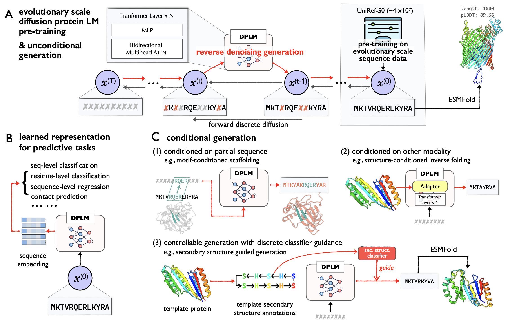

<!-- <div align="center"> -->

# Official Implemetation of DPLM (ICML'24) - Diffusion Language Models Are Versatile Protein Learners
<a href="https://pytorch.org/get-started/locally/"></a>
<a href="https://pytorchlightning.ai/"></a>
<a href="https://hydra.cc/"></a>
<a href="https://github.com/ashleve/lightning-hydra-template"></a><br>

The repository is an official implementation of ICML24 paper [Diffusion Language Models Are Versatile Protein Learners](https://arxiv.org/abs/2402.18567), which introduces **d**iffusion **p**rotein **l**anguage **m**odel (DPLM), a versatile protein language model that demonstrates strong generative and predictive capabilities for protein sequences. Specifically, DPLM exhibits impressive performance in protein sequence generation, motif scaffolding, inverse folding, and representation learning.

We develop DPLM based on the [ByProt](https://github.com/BytedProtein/ByProt). This repository contains pretraining scripts of DPLM, and running scripts of various protein generation and understanding tasks as below:
- **Unconditional protein sequence sampling**:
  DPLM is capable of generating protein sequences with reasonable predicted structures unconditionally.
- **Sequence-conditioned generation: motif scaffolding**:
  DPLM can generate reasonable scaffold sequences given the specific functional motifs. 
- **Structure-conditioned generation: inverse folding**:
  DPLM can produces sequences that can confidently fold into the given backbone structure.
- **Representation learning**:
  DPLM is a superior protein sequence representation learner, demonstrating impressive performance across a variety of protein predictive tasks.
- **Controllable generation**:
  DPLM enjoys plug-and-play programmability, generating samples satisfying provided secondary structure annotations.




### News
- **2024/10/18**: check out our new work [DPLM-2](https://bytedance.github.io/dplm/dplm-2), a multimodal protein foundation model that extends DPLM to simultaneously model, understand, and generate both sequences and structures!

## Installation

```bash
# clone project
git clone --recursive https://url/to/this/repo/dplm.git
cd DPLM

# create conda virtual environment
env_name=dplm

conda create -n ${env_name} python=3.9 pip
conda activate ${env_name}

# automatically install everything else
bash install.sh
```

## Pretraining

### Data

**Download the preprocessed UniRef50 dataset**

We pretrain DPLM on the UniRef50 dataset, which contains about 42 million protein sequences. We obtain the preprocessed UniRef50 dataset provided by [EvoDiff (Alamdari et al, 2023)](https://www.biorxiv.org/content/10.1101/2023.09.11.556673v1).

```bash
bash scripts/download_uniref50.sh
```

### Training

We train DPLM with approximate 1 million tokens per batch and 100,000 training steps. The training script is as follows:

- The following script is runned on one node with 8 A100 GPU. If you want to train on multi nodes, you can adjust the total number of tokens by ensuring that the `max_tokens` \* `accumulate_grad_batches`\*`GPU_number` is approximately 1 million.

```bash
export CUDA_VISIBLE_DEVICES=0,1,2,3,4,5,6,7

max_tokens=8192
accumulate_grad_batches=16
# this means the effective batch size is GPU_number(8) * max_tokens(8192) * accumulate_grad_batcher(16), resulting in approximately 1 million.

exp=lm/dplm_650m
model_name=dplm_650m

python train.py \
    experiment=${exp} name=${model_name} \
    datamodule.max_tokens=${max_tokens} \
    trainer.accumulate_grad_batches=${accumulate_grad_batches}
```

You can adjust the other training configurations in the `configs/experiment/lm/dplm_650m.yaml` as needed. 

## Model checkpoints

Access pretrained models in varying sizes:

| Model name                                                   | Model size      |
| ------------------------------------------------------------ | --------------- |
| [dplm_150m](https://huggingface.co/airkingbd/dplm_150m/tree/main) | 150M parameters |
| [dplm_650m](https://huggingface.co/airkingbd/dplm_650m/tree/main) | 650M parameters |
| [dplm_3b](https://huggingface.co/airkingbd/dplm_3b/tree/main) | 3B parameters   |

Users can load DPLM checkpoint by:

```python
from byprot.models.lm.dplm import DiffusionProteinLanguageModel

model_name = "airkingbd/dplm_650m"
dplm = DiffusionProteinLanguageModel.from_pretrained(model_name)
```

## Unconditional protein sequence generation

The results of unconditional protein sequence generation of DPLM of different scales (150M, 650M, 3B) are shown in the table below. For more details, please refer to our paper.


| Length | 100           | 200           | 300           | 400           | 500           | 600           | 700           | 800           | 900            | 1000           |
| ------ | ------------- | ------------- | ------------- | ------------- | ------------- | ------------- | ------------- | ------------- | -------------- | -------------- |
| 150M   | 73.31         | 84.30         | 84.82         | 86.90         | 81.71         | 81.53         | 81.56         | 80.92         | 78.71          | 72.10          |
| 650M   | 74.00 (+0.69) | 85.61 (+1.31) | 85.91 (+1.09) | 88.16 (+1.26) | 82.58 (+0.87) | 84.38 (+2.85) | 83.87 (+2.31) | 83.00 (+2.08) | 84.92  (+6.21) | 81.51  (+9.41) |
| 3B     | 77.78 (+4.47) | 86.16 (+1.86) | 87.39 (+2.57) | 90.06 (+3.16) | 87.43 (+5.72) | 86.01 (+4.48) | 84.64 (+3.08) | 85.88 (+4.96) | 85.93 (+7.22)  | 83.86 (+11.76) |

To generate new protein sequences using a pre-trained DPLM model:

```bash
model_name=dplm_650m # choose from dplm_150m, dplm_650m, dplm_3b
output_dir=generation-results/${model_name}

mkdir -p generation-results

python generate.py --model_name ${model_name} \
	--seq_lens 100 200 300 400 500 \
	--saveto ${output_dir}
	
# Evaluation
bash anylasis/plddt_compute.sh ${output_dir} # compute pLDDT using ESMFold
```

We also provide evaluation scripts in the  `analysis` folder. Users can use the `analysis/uncond_analysis.ipynb` to obtain average pLDDT score of each length and draw the line chart of the pLDDT score.

## Sequence-conditioned generation: motif scaffolding

We examine 17 motif-scaffolding problems, and for each problem, we sample 100 sequences and then calculate the success rate according to the motif-RMSD < 1$\AA$  and pLDDT > 70. Success rate of each problem is shown below. 

| Motif case   | 1bcf  | 1prw     | 1qjg | 1ycr     | 2kl8     | 3ixt     | 4jhw | 4zyp     | 5ius     | 5tpn | 5trv | 5wn9     | 5yui     | 6e6r     | 6exz     | 6vw1 | 7mrx     |
| ------------ | ----- | -------- | ---- | -------- | -------- | -------- | ---- | -------- | -------- | ---- | ---- | -------- | -------- | -------- | -------- | ---- | -------- |
| Success rate | **1** | **0.95** | 0    | **0.54** | **0.11** | **0.17** | 0    | **0.02** | **0.03** | 0    | 0    | **0.01** | **0.43** | **0.86** | **0.01** | 0    | **0.25** |

We provide the following script to sample sequences for each motif-scaffolding problem. Note that before generation, you should download all the motif pdb files which are provided by [EvoDiff](https://github.com/microsoft/evodiff/tree/main/examples/scaffolding-pdbs), and place them in the data-bin/scaffolding-pdbs folder.

```bash
export CUDA_VISIBLE_DEVICES=0

model_name=dplm_650m
output_dir=./generation-results/${model_name}_scaffold

mkdir -p generation-results

# Generate scaffold 
python scaffold_generate.py \
    --model_name airkingbd/${model_name} \
    --num_seqs 100 \
    --saveto $output_dir

# Predict structure by ESMFold
max_tokens=1024
pdb_path=$output_dir/scaffold_fasta/esmfold_pdb

# folding
mkdir -p $pdb_path

echo 'folding by ESMFold'
output_filename_list=$(ls ${output_dir}/scaffold_fasta)
echo $output_filename_list

python analysis/cal_plddt_dir.py -i ${output_dir}/scaffold_fasta -o ${pdb_path} --max-tokens-per-batch ${max_tokens}
```

For evaluation, users can use the `analysis/motif_analysis.ipynb` to obtain success rate of each problem.

## **Structure-conditioned generation: inverse folding**

The partial results on the CATH 4.3 dataset are shown in the table below. For more details, please refer to our paper.

| Models    | Trainable Params. | AAR       | scTM     | pLDDT     |
|-----------|-------------------|-----------|----------|-----------|
| LM-Design | 6.3M/650M         | 56.49     | 0.85     | 74.89     |
| DPLM-150M | 3.1M/150M         | 53.27     | 0.85     | 75.31     |
| DPLM-650M | 6.3M/650M         | _56.61_   | _0.86_   | _76.78_   |
| DPLM-3B   | 68.2M/3.0B        | **58.64** | **0.86** | **76.95** |

### Data

**Download the preproceesd CATH datasets**

- CATH 4.2 dataset provided by [Generative Models for Graph-Based Protein Design (Ingraham et al, NeurIPS'19)](https://papers.nips.cc/paper/2019/hash/f3a4ff4839c56a5f460c88cce3666a2b-Abstract.html)
- CATH 4.3 dataset provided by [Learning inverse folding from millions of predicted structures (Hsu et al, ICML'22)](https://www.biorxiv.org/content/10.1101/2022.04.10.487779v1) 

```bash
bash scripts/download_cath.sh
```

### Training

We train structure-conditional DPLM based on the [LM-Design](https://github.com/BytedProtein/ByProt) framework, designating the pre-trained protein language model as DPLM. The training script is as below. 

```bash
exp=lm/cond_dplm_650m
dataset=cath_4.3
name=${dataset}/cond_dplm_650m

python train.py \
    experiment=${exp} datamodule=${dataset} name=${name} \
    logger=tensorboard trainer=ddp_fp16 
```

### Evaluation on valid/test datasets

Users can set the `eval_sc` to `true` to calculate the self-consistency TMscore and pLDDT, which will result in a significant evaluation time overhead.

```bash
dataset=cath_4.3
exp_path=${dataset}/cond_dplm_650m
eval_sc=false 
# if set ${eval_sc} to true, the program will calculate the self-consistency 
# TMscore and pLDDT during generation, 
# thus siginificantly increase the evaluation time.

python test.py \                                                                 
    experiment_path=${exp_path} \
    data_split=test ckpt_path=best.ckpt mode=predict \
    task.generator.max_iter=100 task.generator.eval_sc=${eval_sc}
```

## Representation Learning

DPLM excels in various protein prediction tasks, demonstrating its versatility and effectiveness. The following table summarizes its performance:

| Models                | Thermostability | HumanPPI  | Metal Ion Binding | EC        |   GO-MF   |   GO-BP   |   GO-CC   | DeepLoc-Subcellular | DeepLoc-Binary |
| --------------------- | --------------- | --------- | ----------------- | --------- | :-------: | :-------: | :-------: | ------------------- | -------------- |
| ESM2-650M | 0.691           | 84.78     | 71.88             | 0.866     |   0.676   |   0.344   |   0.402   | 83.68               | 92.28          |
| AR-LM                 | 0.638           | 68.48     | 61.66             | 0.691     |   0.566   |   0.258   |   0.287   | 68.53               | 88.31          |
| DPLM(150M)            | 0.687           | 80.98     | 72.17             | 0.822     |   0.662   |   0.328   |   0.379   | 82.41               | 92.63          |
| DPLM(650M)            | _0.695_         | _86.41_   | _75.15_           | _0.875_   |  _0.680_  |  _0.357_  |  _0.409_  | _84.56_             | _93.09_        |
| DPLM(3B)              | **0.704**       | **90.00** | **75.94**         | **0.883** | **0.687** | **0.369** | **0.463** | **85.32**           | **93.93**      |

The training and evaluation pipeline is based on the [Saprot](https://github.com/westlake-repl/SaProt/tree/main) repository, and we slightly modify the code to support DPLM. Users can select the "representationlearning" branch for the evaluation of protein predictive tasks.

## Acknowledgements

DPLM extends its gratitude to the following projects and individuals.

We draw inspiration and leverages/modifies implementations from:
- [microsoft/evodiff](https://github.com/microsoft/evodiff) for the preprocessed UniRef50 dataset, sequence sampling evaluation implementation and data pipeline.
- [westlake-repl/SaProt](https://github.com/westlake-repl/SaProt/tree/main) for the representation learning evaluation pipeline.

- [jingraham/neurips19-graph-protein-design](https://github.com/jingraham/neurips19-graph-protein-design) for the preprocessed CATH dataset.
- [facebook/esm](https://github.com/facebookresearch/esm/) for their ESM implementations and pretrained model weights.
- [jasonkyuyim/se3_diffusion](https://github.com/jasonkyuyim/se3_diffusion) for their self-consistency structural evaluation implementation.

We express our sincere appreciation to the authors of these repositories for their invaluable contributions to the development of DPLM.

## Citation

```
@inproceedings{wang2024diffusion,
  title={Diffusion Language Models Are Versatile Protein Learners},
  author={Wang, Xinyou and Zheng, Zaixiang and Ye, Fei and Xue, Dongyu and Huang, Shujian and Gu, Quanquan},
  booktitle={International Conference on Machine Learning},
  year={2024}
}
```

